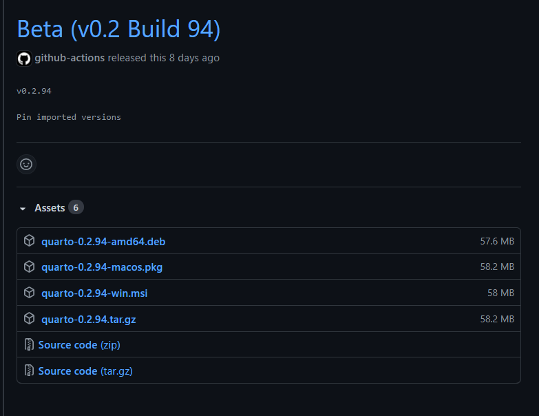
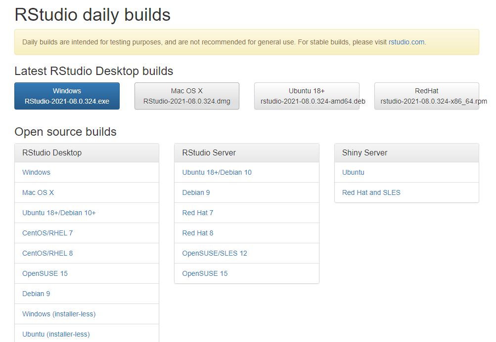

```{r setup, include=FALSE}
options(htmltools.dir.version = FALSE)
episode_counter <- 0
knitr::opts_chunk$set(
  collapse = TRUE,   
  comment = "#>"
)
```

class: title-slide, left, middle
background-image: url("images/renoir.jpg")
background-position: right
background-size: contain
background-color: #0071B8

.pull-left[

# `r rmarkdown::metadata$title`

## `r rmarkdown::metadata$subtitle`

### `r rmarkdown::metadata$author` &#183; RStudio

#### [r3-rmedicine.netlify.app](https://r3-rmedicine.netlify.app)
]

---
class: middle, center

# Wrap Up

Installing Quarto on your own machine

Python + other editing programs demo

Example project site

Q & A Session

---
class: center, middle

# `r fontawesome::fa("desktop")`

# Go to the R3 Quarto Example Site

[`r fontawesome::fa("paper-plane")`  https://tinyurl.com/r3-quarto-example](https://tinyurl.com/r3-quarto-example)

---

class: middle, center, inverse

# Setting up Quarto on your machine

---
class: middle

# Basic setup:

You'll need:

1. The Quarto command line interface (CLI)
2. An R Studio Daily Build


---
class: middle, center

## Quarto CLI

.pull-left[
You can install the latest version of the Quarto CLI from [https://github.com/quarto-dev/quarto-cli/releases/latest](https://github.com/quarto-dev/quarto-cli/releases/latest)
]

.pull-right[

]


---
class: middle, center

## R Studio Daily Build

.pull-left[
You can install a daily build of R Studio from [https://dailies.rstudio.com/](https://dailies.rstudio.com/)
]

.pull-left[

]

---


class: middle

Once you have both of these installed, you're ready to use Quarto on your local machine!

---
class: middle, center, inverse

# Python, Jupyter, and Quarto


---
class: middle

.pull-left[
Quarto can directly render Jupyter notebooks
]

.pull-left[

]

---
class: middle, center, inverse

# Quarto projects

---
class: middle

A Quarto project is a collection of documents (qmd, md, Rmd, and ipynb files) that are unified by a `_quarto.yml` file. This `_quarto.yml` file does a lot, including:

- A way to render all or some of the files in a directory with a single command (e.g. quarto render myproject).
- A way to share YAML configuration across multiple documents.
- The ability to redirect output artifacts to another directory.
- The ability to freeze rendered output (i.e. don’t re-execute documents unless they have changed).

---
class: middle, center

The R3 Quarto Example site is an example of a Quarto book project:

[`r fontawesome::fa("paper-plane")`  https://tinyurl.com/r3-quarto-example](https://tinyurl.com/r3-quarto-example)

---
class: middle

## Further reading

Read more about Quarto projects at the Quarto docs:

https://quarto.org/docs/projects/quarto-projects.html


---
class: middle, center, inverse

# Q & A 

---
class: middle, center

# Who we are (again)

.columns[

.left-col[
### Alison Hill


[`r fontawesome::fa("github")` @apreshill](https://github.com/apreshill)    
[`r fontawesome::fa("twitter")` @apreshill](https://twitter.com/apreshill)   
[`r fontawesome::fa("link")` alison.rbind.io](https://alison.rbind.io)
]

.middle-col[
### Stephan Kadauke


[`r fontawesome::fa("github")` @skadauke](https://github.com/skadauke)   
[`r fontawesome::fa("twitter")` @StephanKadauke](https://twitter.com/StephanKadauke)
]


.right-col[
### Paul Villanueva


[`r fontawesome::fa("github")` @pommevilla](https://github.com/pommevilla)    
[`r fontawesome::fa("twitter")` @pommevilla](https://twitter.com/pommevilla)  
[`r fontawesome::fa("link")` pommevilla.rbind.io](https://pommevilla.rbind.io/)
]
]


---

class: middle, center

# Thank you! 

## Have a nice day!
